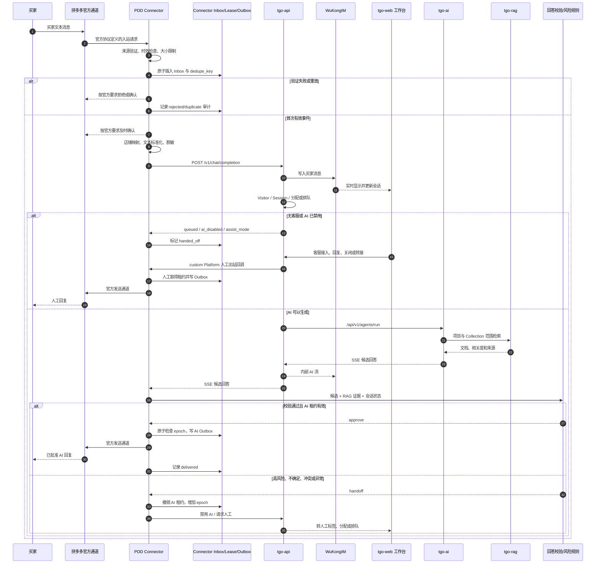

# 拼多多客服完整数据流

## 1. 总览



图中的“官方协议定义”表示实际实现必须来自获得授权的拼多多官方资料；本设计不指定回调地址、字段或签名算法。

## 2. 入站阶段

### 2.1 接收与快速确认

1. 公网请求只进入 Connector 网关。
2. 网关执行连接数、请求大小、速率和超时限制。
3. 协议 Adapter 按官方资料完成来源验证、必要的解密和响应格式。
4. 验证成功后先将事件写入 Inbox，再向外部返回成功确认。
5. 数据库不可用时不进行无账本业务处理。

快速确认和异步处理分离，避免模型、RAG 或 TGO 延迟导致渠道重复投递。

### 2.2 去重

`(binding_id, dedupe_key)` 是数据库唯一键：

- 首次插入：状态 `received`，允许继续。
- 唯一键冲突：记录重复计数和最近接收时间，不再调用 TGO。
- 同一事件先失败后重试：继续原 Inbox 状态机，不创建新业务事件。

摘要日志只记录 `trace_id`、脱敏事件引用和去重结果，不记录完整原始请求。

### 2.3 映射和标准化

Connector 按已验证店铺绑定取得：

- `tgo_project_id`
- `tgo_platform_id`
- TGO Platform API Key 的 Secret 引用
- 规则版本和自动回复开关

外部买家标识按绑定加盐生成稳定 `buyer_ref`，作为 TGO `from_uid`。同一店铺同一买家可映射到同一 Visitor，不同租户不能碰撞或互查。

第一版只接受文本。非文本、空文本、超长文本、编码异常或未知事件记录原因后转人工。

## 3. TGO 记录与会话阶段

Connector 调用 `repos/tgo-api/app/api/v1/endpoints/chat.py:chat_completion` 对应接口。

TGO 执行：

1. 平台 API Key 校验并确定 Project。
2. 按 `from_uid` 创建或更新 Visitor。
3. 建立 `{visitor_uuid}-vtr`、频道类型 251 的客服频道。
4. 将买家消息发到 WuKongIM。
5. 未分配 Visitor 调用 `transfer_to_staff`。
6. 有客服则建立开放 Session；无客服进入 Waiting Queue。
7. 根据 `visitor.ai_disabled` 和 `platform.ai_mode` 决定是否调用 AI。

Connector 只有在收到并持久化 TGO 处理结果后，才将 Inbox 标为 `tgo_recorded`。

## 4. RAG 与候选回答阶段

AI 路径：

1. `tgo-api` 调用 `tgo-ai /api/v1/agents/run`。
2. `SupervisorRuntimeService` 解析 Project 默认 Agent。
3. `AgnoAgentBuilder` 只挂载该 Agent 已启用的 Collection。
4. RAG 搜索携带 `project_id` 和 `collection_id`。
5. `SearchService` 执行语义、全文或混合检索。
6. Agent 产生 SSE 候选回答。

Connector 聚合 SSE 时必须处理：

- 正常内容事件。
- `queued`、`ai_disabled`、`assist_mode`。
- Agent 失败、取消、超时或流中断。
- 空内容、超长内容和非预期事件。

流中断或未知终态不允许发送已收到的半截文本。

## 5. 边界检查阶段

Guard 依次执行：

1. **会话检查**：Visitor 未关闭，未处于人工优先状态。
2. **租约检查**：AI owner、epoch 和 run ID 一致。
3. **证据检查**：必须存在允许自动回答的有效知识来源。
4. **范围检查**：证据属于当前 Project 和允许的 Collection。
5. **风险检查**：不涉及交易写操作、实时订单结论、赔付承诺或个人数据。
6. **注入检查**：候选没有服从买家要求泄露系统信息、跨租户查询或调用未授权工具。
7. **一致性检查**：回答中的关键事实可由证据支持，多个来源无冲突。
8. **输出检查**：长度、语言、链接、敏感信息和格式满足店铺策略。

任何一项失败都输出 `handoff`。`rewrite` 只做确定性删减、模板包装或敏感片段移除，改写后必须从第一项重新校验。

## 6. 自动回复阶段

Guard 通过后：

1. Connector 在数据库事务中重新读取会话租约。
2. 比较 AI run 开始时的 epoch。
3. 确认没有人工发送、转接、关闭或禁用 AI。
4. 以唯一 `reply_id` 写入 Outbox。
5. 独立发送 Worker 依据官方协议发送。
6. 成功确认后标记 `delivered`；结果不明确则保持 `unknown`，按官方幂等能力处置。

TGO/WuKongIM 中出现候选回答不等于 PDD 已送达。只有 Outbox `delivered` 才是外部送达事实。

## 7. 人工转接和人工回复阶段

触发条件包括：

- Guard `handoff`。
- TGO 返回 queued、ai_disabled 或 assist_mode。
- 买家明确要求人工。
- Connector、AI、RAG、审计或规则服务异常。
- 非文本、未知或高风险内容。

动作：

1. 撤销 AI 租约并增加 epoch。
2. 通过 TGO 现有路径设置 `ai_disabled=True`。
3. 添加转人工标签和脱敏原因码。
4. 有客服则分配，无客服则排队。
5. 工作台通过 WuKongIM 和 Queue 事件刷新。

人工回复：

1. 客服在 `tgo-web` 输入文本。
2. 非网站渠道先调用 `tgo-api /v1/chat/messages/send`。
3. `tgo-api` 校验 `chat:send`、Channel Member、Project 和 Platform。
4. `tgo-platform` 的 custom callback 将消息交给 Connector。
5. Connector 原子取得 human 租约、增加 epoch、写 Outbox。
6. 发送成功后审计 staff ID、reply ID 和结果。
7. `tgo-web` 同时通过 WuKongIM 展示人工消息。

## 8. 状态对应

| Connector 状态 | TGO 状态 | 含义 |
|---|---|---|
| `received/verified/normalized` | 尚未创建 | Connector 接入阶段 |
| `tgo_recorded` | Visitor 已创建；Session 可能 open 或 queued | 工作台已可见 |
| `candidate_ready` | AI 流已进入内部频道 | 候选未必已外发 |
| `handed_off` | `ai_disabled=True`，active 或 queued | 人工优先 |
| `auto_replied` | Session 仍 open | AI Outbox 已送达 |
| `failed/dead_letter` | 保留现有会话 | 自动处理失败，人工介入 |

## 9. 关键失败路径

| 失败点 | 处理 | 禁止行为 |
|---|---|---|
| 验证失败 | 拒绝并审计 | 不解析业务内容、不调用 TGO |
| 重复事件 | 返回幂等确认 | 不重复写 TGO、不重复生成 |
| TGO 超时 | Inbox 重试 | 不直接调用模型绕过会话 |
| AI/RAG 超时 | 转人工 | 不发送半截文本或无证据回答 |
| Guard 失败 | 转人工 | 不通过 Prompt 自行放宽 |
| 人工抢占 | epoch 增加，旧 AI 失效 | 不等待 AI 发送完成后再切换 |
| 外部发送超时 | Outbox `unknown` | 不使用新 reply ID 盲目重发 |
| 审计失败 | 停止自动回复 | 不产生无审计自动发送 |

## 10. 全链路关联

同一业务链使用一个 Connector `trace_id`：

```text
trace_id
  ├─ inbox_id / dedupe_key
  ├─ tgo_project_id / platform_id / visitor_id / session_id
  ├─ ai_run_id / agent_id / collection_ids
  ├─ policy_version / guard_result
  ├─ reply_lease_epoch
  └─ outbox_reply_id / delivery_result
```

对外展示或日志使用脱敏引用。只有受控审计角色可以沿 `raw_payload_ref` 访问加密原始事件。
