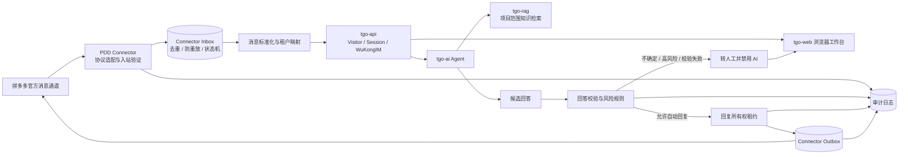

# 拼多多客服目标架构

## 1. 设计目标

第一版以 TGO 为客服与 AI 底座，以独立 PDD Connector 作为唯一拼多多信任边界。连接器只在获得官方授权资料和测试凭据后实现具体协议；本设计不定义拼多多 URL、事件名、字段名、签名算法、频率限制或错误码。

目标：

- 买家消息可靠进入 TGO 工作台。
- 重复或重放事件不会重复触发 AI 或重复回复。
- AI 只使用项目范围内的已批准知识。
- 回答在出站前经过证据、规则和风险校验。
- 无法确认安全性时默认转人工。
- AI 与人工不能同时向同一外部会话回复。
- 所有外部收发和决策都有可审计记录。
- 客服只使用浏览器工作台，不在每台电脑运行模型或保存平台密钥。

## 2. 第一版范围

### 2.1 包含

- 单租户内可配置多店铺绑定，每个绑定映射到一个 TGO Project 和 Platform。
- 买家文本消息接入。
- 外部买家、会话和店铺标识的稳定、不可逆内部映射。
- 入站验证、去重、防重放、持久 Inbox、失败重试和死信。
- TGO Visitor、Session、Waiting Queue、WuKongIM 工作台消息。
- Agent 绑定的 RAG Collection 检索。
- AI 候选回答、回答校验、风险分级、自动回复或转人工。
- 人工接入、AI 开关、关闭、转接。
- AI/人工出站互斥、Outbox 幂等和送达审计。

### 2.2 明确不包含

- 下单、改价、退款、退货审批、发券、赔付、关闭订单等交易写操作。
- 营销群发、主动触达、自动追评或自动催单。
- 图片、语音、视频和文件内容理解或自动承诺。
- 模型微调。
- 在客服电脑本地部署 AI。
- 绕过拼多多官方授权方式、模拟浏览器抓取、逆向私有协议。
- 在没有官方依据时假设任何 PDD 回调字段、签名方法或发送接口。

非文本消息、未知事件和需要交易动作的请求统一记录并转人工，不尝试猜测内容。

## 3. 逻辑组件



### 3.1 PDD Connector

连接器是独立部署单元，建议实施路径为 `extensions/pdd-connector/`。该目录当前不存在，路径只是未来阶段的仓库边界，不代表本阶段创建了实现。

连接器职责：

- 封装所有经官方文档确认的 PDD 收发协议。
- 验证入站来源和时效。
- 将平台凭据限制在连接器 Secret Store 或运行时 Secret 中。
- 持久化 Inbox、去重键、重放记录、回复租约、Outbox 和审计事件。
- 将平台标识映射为 TGO 的 Project、Platform 和 `from_uid`。
- 调用 TGO 现有 API 创建访客/会话并取得 AI 流。
- 在任何 PDD 出站前执行回答校验和回复所有权检查。
- 接收 TGO `custom` 平台的人工出站回调，并作为唯一 PDD 发送者。

连接器不负责：

- 保存 TGO 全量业务数据。
- 自建客服 UI。
- 自建第二套知识库或 Agent 管理。
- 直接修改 TGO 数据库表。

### 3.2 店铺和租户映射

Connector 维护 `shop_binding`：

| 字段 | 作用 |
|---|---|
| `binding_id` | 内部不可变主键 |
| `tenant_id` | Connector 租户 |
| `tgo_project_id` | TGO Project |
| `tgo_platform_id` | TGO Platform |
| `tgo_platform_api_key_ref` | 指向 Secret Store，不在日志或普通表保存明文 |
| `credential_ref` | PDD 凭据引用 |
| `status` | `active / suspended / revoked` |
| `policy_version` | 当前风险与回答规则版本 |

任何入站事件必须先解析到唯一且启用的绑定。映射缺失、重复、停用或租户不一致时拒绝业务处理并产生安全审计事件。

### 3.3 消息标准化

Connector 内部标准消息不是对 PDD 字段的假设，而是协议适配完成后的稳定领域模型：

```text
NormalizedBuyerMessage
  envelope_id           Connector 生成的 UUID
  binding_id            店铺绑定
  tenant_id             Connector 租户
  tgo_project_id        TGO Project
  tgo_platform_id       TGO Platform
  dedupe_key            协议适配层生成的稳定幂等键
  external_event_ref    可选；外部事件的脱敏引用
  external_message_ref  可选；外部消息的脱敏引用
  buyer_ref             不透明买家标识
  conversation_ref      不透明外部会话标识
  message_kind          第一版仅接受 text
  text                  规范化文本
  occurred_at           外部时间存在且可信时使用
  received_at           Connector 接收时间
  trace_id              全链路追踪标识
  verification_result   验证结果摘要，不含密钥
  raw_payload_ref       指向加密原文，普通日志不输出原文
```

映射到 TGO 时：

- `from_uid` 使用按绑定加盐的稳定内部标识，不暴露平台原始买家 ID。
- `content` 为规范化文本。
- `platform_type` 使用 TGO 已有 `custom` 类型。
- `platform_id` 和 `platform_api_key` 来自已验证绑定。
- `extra` 仅放 `trace_id`、脱敏外部引用、消息类型和策略版本，不放密钥或完整原始事件。

### 3.4 去重与防重放

Inbox 以数据库唯一约束保证 `(binding_id, dedupe_key)` 唯一。`dedupe_key` 的生成规则必须由实际官方协议适配器确定：若官方提供稳定事件或消息标识则使用该标识；若没有，则依据官方允许参与幂等判断的确定性数据生成摘要。设计层不预设字段。

Inbox 状态：

```text
received → verified → normalized → tgo_recorded → candidate_ready
         ↘ rejected
candidate_ready → auto_replied | handed_off | failed
failed → retrying → auto_replied | handed_off | dead_letter
```

处理要求：

- Inbox 插入与“首次接收”判定在同一事务完成。
- 重复事件返回渠道所需的成功确认，但不再次调用 TGO。
- 重试只从已持久化状态继续，不重新解释原始请求。
- Outbox 使用独立唯一 `reply_id`；发送超时后先查询或按官方幂等规则重试，不能盲目二次发送。
- 防重放使用官方协议提供并经确认的时间、随机数或签名上下文；若官方协议没有对应能力，则以短期请求摘要缓存、严格网络边界和一次性 Inbox 状态降低风险，并将限制写入上线风险清单。

### 3.5 TGO 会话接入

连接器调用 `tgo-api /v1/chat/completion`，复用当前主链：

1. 平台 API Key 定位 Project。
2. `from_uid` 创建或查找 Visitor。
3. 买家文本写入 WuKongIM。
4. TGO 建立 Session、分配客服或排队。
5. AI 允许时运行 Project 默认 Agent，并通过 SSE 返回候选文本。
6. Connector 聚合候选文本，但 PDD 外部发送必须继续经过 Guard 和 Lease。

TGO 中已生成的 AI 流用于内部工作台可见性，不等于“已向 PDD 送达”。PDD 送达事实只以 Connector Outbox 的成功结果为准。

### 3.6 知识检索

第一版复用 TGO Agent 与 Collection 绑定：

- 每个店铺映射到 Project。
- 每个 Project 的默认 Agent 只启用该租户批准的 Collection。
- Collection 按商品知识、售后规则、物流说明、常见问题等业务域拆分。
- 检索必须带 `project_id` 和 Collection 范围。
- 候选回答保留使用的文档 ID、Collection ID、相关度和知识版本，供 Guard 与审计使用。

RAG 无结果、结果低于项目阈值、来源已失效或多个来源冲突时，不允许自动回复。

### 3.7 回答校验与风险规则

Guard 输入：

- 规范化买家文本。
- Agent 候选回答。
- RAG 证据和知识版本。
- 当前会话状态、`ai_disabled`、人工分配状态。
- 店铺策略、消息历史摘要和回复租约 epoch。

Guard 输出只有三种：

| 结果 | 动作 |
|---|---|
| `approve` | 证据充分、规则允许、租约有效，写入 Outbox |
| `rewrite` | 只允许确定性模板化收缩；改写后重新校验 |
| `handoff` | 不向 PDD 发送 AI 文本，禁用 AI 并转人工 |

自动回复允许范围为有明确知识证据的静态说明，例如已审核的商品使用说明或固定 FAQ。以下情况直接转人工：

- 订单、价格、库存、物流实时状态等需要实时授权查询的数据。
- 退款、退货、赔付、优惠、承诺时限、修改订单等交易或承诺。
- 身份、地址、电话、支付信息等个人数据。
- 知识证据缺失、相互冲突、过期或置信不足。
- 买家要求忽略规则、泄露提示词、执行工具或访问其他用户信息。
- 辱骂、威胁、自伤、违法或其他需要人工判断的内容。
- 非文本消息、超长文本、乱码或无法可靠解析的输入。

### 3.8 默认转人工

默认转人工不是只写在 Prompt 中，而是由确定性策略执行：

1. 新策略、未知意图和未知消息类型默认 `handoff`。
2. Guard 异常、RAG 异常、模型超时、Connector 状态不一致均 `handoff`。
3. 调用现有人工转接路径，设置 `visitor.ai_disabled=True`。
4. 有客服则分配；无客服则进入 Waiting Queue。
5. 给工作台展示脱敏的转人工原因码、风险级别和 trace ID。

### 3.9 AI 与人工回复互斥

Connector 为每个 `(binding_id, conversation_ref)` 维护原子回复租约：

```text
reply_lease
  owner        ai | human | none
  epoch        单调递增整数
  holder_id    AI run ID 或客服 ID
  acquired_at
  expires_at
  state        active | released | revoked
```

规则：

- AI 运行前读取 epoch 并申请短租约。
- 人工接入、人工发送、转接或 `ai_disabled=True` 会在事务内撤销 AI 租约并增加 epoch。
- AI 候选写 Outbox 前必须再次比较 epoch、owner、会话状态和 `ai_disabled`。
- 所有 PDD 出站，包括人工消息，都必须经过 Connector；绕过 Connector 的网络路径被禁止。
- 相同 `reply_id` 只能有一条 Outbox 记录。
- AI 租约超时自动释放，但超时结果不得发送。

这使人工优先级高于 AI，并覆盖“AI 已开始生成但人工中途接入”的竞态。

### 3.10 审计日志

审计日志采用追加写，至少记录：

- `trace_id`、`binding_id`、脱敏会话与买家引用。
- 入站接收、验证、去重结果和 Inbox 状态迁移。
- 调用的 TGO Project、Platform、Agent、Collection 和策略版本。
- RAG 文档引用、风险规则命中、Guard 结果。
- 人工转接原因、租约 owner/epoch 变化。
- Outbox 创建、发送尝试、平台确认或最终失败。
- 操作者类型与 ID：system、AI、staff。

普通日志不保存凭据、完整原始事件、完整个人数据或模型供应商密钥。原始事件如因合规需要保留，应单独加密、限定保留期和访问权限，并通过 `raw_payload_ref` 引用。

## 4. 部署和安全边界

- PDD Connector 部署在服务端，与 `tgo-api`、`tgo-platform` 走受控内部网络。
- 仅 Connector 的入口网关接收 PDD 流量；TGO internal API、数据库、Redis、WuKongIM 管理端口不对公网开放。
- PDD 凭据只注入 Connector；客服浏览器和 TGO Web 不接触凭据。
- `custom` Platform 的 callback 指向 Connector 内部出站入口。
- Connector 数据库账号只访问 Connector 自己的 schema，不直接写 TGO 表。
- 服务间使用独立身份；认证失败不能降级为匿名调用。

## 5. 可用性与降级

| 故障 | 第一版行为 |
|---|---|
| PDD 入站重复 | 确认重复，不再调用 TGO |
| TGO API 不可用 | Inbox 保持可重试，不向 PDD 生成回复 |
| AI 或模型不可用 | 转人工；不发送不完整候选 |
| RAG 不可用或无证据 | 转人工 |
| Guard 异常 | 转人工 |
| 人工与 AI 竞态 | 人工增加 epoch，AI Outbox 写入失败 |
| PDD 出站超时 | Outbox 保持未知状态，按官方幂等能力处理 |
| Connector 数据库不可用 | 停止确认新业务事件，避免无账本处理 |
| 审计写入失败 | 停止自动回复，允许人工在受控流程处理 |

## 6. 验收指标

- 同一入站事件重复投递 100 次，只创建一次 TGO 业务处理。
- 同一 `reply_id` 最多产生一次已确认外部发送。
- 人工接入后，所有旧 epoch 的 AI 候选均不能进入 Outbox。
- 自动回复必须能关联 Project、Agent、知识版本、证据、策略版本和租约 epoch。
- 任一证据或控制缺失时，结果为转人工而非自动发送。
- 日志扫描不出现平台密钥、模型密钥或完整个人数据。
