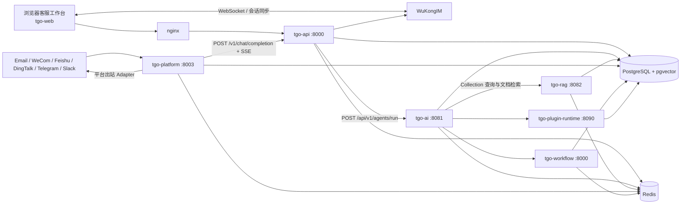

# TGO 当前架构

## 1. 文档范围与证据口径

本文描述当前仓库已经存在的服务、调用链、消息模型、数据组件和人工客服流程。结论以当前分支源码为准；文中“当前”不包含拼多多连接器或任何尚未实现的扩展。

主要证据入口：

- 服务编排：`docker-compose.yml`、`docker-compose.dev.yml`
- API 入口：`repos/tgo-api/app/main.py:create_app`、`repos/tgo-api/app/internal.py`
- 渠道入口：`repos/tgo-platform/app/main.py:lifespan`
- AI 入口：`repos/tgo-ai/app/api/v1/agents.py:run_supervisor_agent`
- RAG 入口：`repos/tgo-rag/src/rag_service/main.py:setup_routers`
- 工作流入口：`repos/tgo-workflow/app/api/executions.py:execute_workflow`
- 插件入口：`repos/tgo-plugin-runtime/app/main.py`、`repos/tgo-plugin-runtime/app/api/routes.py`
- 浏览器工作台：`repos/tgo-web/src/pages/ChatPage.tsx`

## 2. 服务职责

| 服务 | 当前职责 | 关键入口或证据 |
|---|---|---|
| `tgo-api` | 租户、项目、平台、访客、客服、会话、排队、权限、WuKongIM 协调以及对外聊天 API | `repos/tgo-api/app/main.py:create_app`；`repos/tgo-api/app/api/v1/endpoints/chat.py:chat_completion` |
| `tgo-api` internal | 供内部服务调用的无认证 API，容器内监听 8001，不应暴露到不可信网络 | `repos/tgo-api/README.md`；`repos/tgo-api/app/internal.py` |
| `tgo-ai` | Agent、模型供应商、工具、知识库绑定、会话记忆和 Agent 运行；支持同步与 SSE | `repos/tgo-ai/app/api/v1/agents.py:run_supervisor_agent`；`repos/tgo-ai/app/runtime/supervisor/application/service.py:SupervisorRuntimeService` |
| `tgo-rag` | Collection、文件、网站、QA、切分、Embedding、pgvector 检索、全文检索与混合检索 | `repos/tgo-rag/src/rag_service/routers/collections.py:search_collection_documents`；`repos/tgo-rag/src/rag_service/services/search.py:SearchService` |
| `tgo-platform` | 第三方渠道接入、Webhook 验证、Inbox 消费、消息标准化、调用 `tgo-api`、平台出站适配 | `repos/tgo-platform/app/main.py:lifespan`；`repos/tgo-platform/app/domain/services/dispatcher.py:process_message` |
| `tgo-web` | 浏览器客服工作台：会话列表、实时消息、排队接入、AI 开关、结束与转接 | `repos/tgo-web/src/pages/ChatPage.tsx`；`repos/tgo-web/src/components/layout/ChatWindow.tsx` |
| `tgo-workflow` | 图式工作流定义与执行，支持同步、Celery 异步和 SSE；节点可调用 Agent、LLM、工具或 HTTP API | `repos/tgo-workflow/app/engine/executor.py:WorkflowExecutor`；`repos/tgo-workflow/app/api/executions.py:execute_workflow` |
| `tgo-plugin-runtime` | 安装并管理独立插件进程，通过 Unix Socket 或开发态 TCP 通信；提供工具栏、访客面板和 MCP 工具等能力 | `repos/tgo-plugin-runtime/app/services/process_manager.py:ProcessManager`；`repos/tgo-plugin-runtime/app/services/socket_server.py` |
| WuKongIM | 客服频道、实时消息、会话同步和 WebSocket 事件传输 | `docker-compose.yml` 的 `wukongim`；`repos/tgo-api/app/services/wukongim_client.py` |

`repos/tgo-api/app/main.py:create_app` 已提供 `additional_routers`、`additional_middlewares`、`startup_hooks` 和 `shutdown_hooks` 四类进程内扩展点。仓库根目录当前没有 `extensions/`，因此任何 `extensions/...` 路径只能作为目标架构建议，不能视作现有实现。

## 3. 部署拓扑与服务调用

当前主要端口和调用关系：

| 调用方 | 被调用方 | 用途 |
|---|---|---|
| `tgo-platform` | `tgo-api:8000 /v1/chat/completion` | 将标准化渠道消息交给访客/会话/AI 主链，消费 SSE |
| `tgo-api` | `tgo-ai:8081 /api/v1/agents/run` | 运行默认或指定 Agent |
| `tgo-ai` | `tgo-rag:8082 /v1/collections/.../documents/search` | 获取 Collection 信息并检索知识 |
| `tgo-ai` | `tgo-workflow:8000` | 将已绑定工作流构造成 Agent 工具 |
| `tgo-ai` | `tgo-plugin-runtime:8090` | 执行插件工具 |
| `tgo-api`、`tgo-web` | WuKongIM | 写消息、维护频道成员、同步会话、接收实时事件 |
| WuKongIM | `tgo-api:8000 /v1/integrations/wukongim/webhook` | 回传消息和系统事件 |
| `tgo-api` | `tgo-platform:8003 /v1/messages/send` | 将人工坐席的非网站渠道消息转发给平台服务 |

`docker-compose.yml` 使用同一 PostgreSQL 实例；服务以各自表和迁移维护边界。Redis 逻辑库在编排文件中分配为：API/Platform 使用 DB 0，AI 使用 DB 1，RAG/Workflow 使用 DB 2，Device Control 使用 DB 3。

## 4. 当前渠道接入和消息数据流

### 4.1 渠道生产者与 Inbox

`tgo-platform` 已有 Email、WeCom、WeCom Bot、Feishu Bot、DingTalk Bot、Telegram、Slack 和 WuKongIM 监听器。`repos/tgo-platform/app/main.py:lifespan` 在启动时创建监听器，在关闭时逐个停止。

Webhook 渠道采用“验证并入 Inbox，随后异步消费”的模式：

1. `repos/tgo-platform/app/api/v1/callbacks.py` 验证渠道签名，并在渠道要求时解密消息。
2. 原始事件写入对应 Inbox 表，成功后尽快响应渠道。
3. 唯一约束冲突产生 `IntegrityError` 时按重复投递成功处理。
4. Listener 查询 `pending` 以及达到退避时间的 `failed` 记录。
5. 记录状态改为 `processing`，标准化后交给 `dispatcher.process_message`。
6. 成功后标记 `completed`；失败后标记 `failed`、增加 `retry_count` 并记录受限长度错误。

现有 Inbox 和唯一键：

| 模型 | 唯一性 |
|---|---|
| `EmailInbox` | `(platform_id, message_id)` |
| `WeComInbox` | `(platform_id, message_id)` |
| `WuKongIMInbox` | `(platform_id, message_id)` |
| `FeishuInbox` | `(platform_id, message_id)` |
| `DingTalkInbox` | `(platform_id, message_id)` |
| `TelegramInbox` | `(platform_id, message_id, chat_id)` |
| `SlackInbox` | `(platform_id, channel_id, ts)` |

证据位于 `repos/tgo-platform/app/db/models.py`。这些是渠道表级幂等，不是跨渠道统一消息账本。

### 4.2 标准消息与 Dispatcher

`repos/tgo-platform/app/domain/entities.py:NormalizedMessage` 当前字段为：

- `source`
- `from_uid`
- `content`
- `platform_api_key`
- `platform_type`
- `platform_id`
- `extra`

`repos/tgo-platform/app/domain/services/normalizer.py:DefaultMessageNormalizer` 是最小透传实现。`dispatcher.process_message` 最多尝试三次，调用 `tgo-api` 并根据平台选择 Adapter；流式 Adapter 逐事件输出，非流式 Adapter 聚合最终文本。若收到 `ai_disabled`，不会向外部渠道发送 AI 回复。

### 4.3 `tgo-api` 聊天主链

`repos/tgo-api/app/api/v1/endpoints/chat.py:chat_completion` 的顺序是：

1. 用平台 API Key 定位有效平台和项目。
2. 按 `platform_open_id/from_uid` 创建或更新 `Visitor`。
3. 生成或采用客服频道，默认格式为 `{visitor_uuid}-vtr`、频道类型 251。
4. 将买家消息尽力写入 WuKongIM。
5. 未分配访客调用 `transfer_to_staff`；没有可用客服时进入等待队列并停止 AI。
6. 已有客服后，通过 `visitor.ai_disabled` 与 `platform.ai_mode` 判断是否运行 AI。
7. AI 开启时调用 `tgo-ai /api/v1/agents/run`。
8. 将 Agent SSE 转换为 WuKongIM 的流消息事件。

当前 AI 回复在 WuKongIM 中使用已分配客服的 `{staff_id}-staff` UID 作为发送者。现有实现因此把“建立人工会话”和“允许 AI 生成”放在同一主链中。

### 4.4 AI 与 RAG

`repos/tgo-ai/app/runtime/supervisor/application/service.py:SupervisorRuntimeService` 解析 Agent，构造执行上下文并调用 `AgnoAgentBuilder` 和 `AgnoAgentRunner`。运行上下文包含 `project_id`、`session_id`、`user_id`、`message`、`rag_url` 和 `mcp_url`。

知识库绑定由以下模型表达：

- `repos/tgo-ai/app/models/agent.py:Agent.collections`
- `repos/tgo-ai/app/models/collection.py:AgentCollection`
- `repos/tgo-ai/app/runtime/supervisor/agents/builder.py:AgnoAgentBuilder._build_agent_config`

每个已启用 Collection 被构造成 `rag_search_<短ID>` 工具。`repos/tgo-ai/app/runtime/tools/utils.py:create_rag_tool` 调用 RAG 的 Collection 查询和文档搜索接口。

RAG 搜索在 `repos/tgo-rag/src/rag_service/services/search.py:SearchService` 中实现：

- `semantic_search`：项目和 Collection 范围内的向量相似度。
- `keyword_search`：中文使用 `pg_trgm` 相似度/包含匹配，其他文本使用 PostgreSQL 全文检索。
- `hybrid_search`：并行语义与关键词检索，以 RRF 合并排序并写入可追踪排名元数据。

RAG 数据模型包括：

- `rag_collections`：`repos/tgo-rag/src/rag_service/models/collections.py:Collection`
- `rag_file_documents`：文本块、全文索引、Embedding 与元数据
- `rag_qa_pairs`：问题哈希去重、答案、分类、来源和处理状态

所有 Collection 和检索路径都显式带 `project_id`，用于租户隔离。

## 5. 消息、访客和会话模型

TGO 的聊天正文主要由 WuKongIM 保存和分发；`tgo-api` 不维护一张完整的业务消息表。`tgo-platform` Inbox 保存渠道接入事件，`tgo-api` 保存访客、会话、队列、成员和分配历史。

| 模型 | 当前状态或作用 | 源码 |
|---|---|---|
| `Visitor` | `new → queued → active → closed`；含 `platform_open_id`、`assigned_staff_id`、`ai_disabled` | `repos/tgo-api/app/models/visitor.py` |
| `VisitorSession` | `open / closed`；绑定访客和客服 | `repos/tgo-api/app/models/visitor_session.py` |
| `VisitorWaitingQueue` | `waiting / assigned / cancelled / expired`；来源含 `ai_request/visitor/transfer/system/no_staff` | `repos/tgo-api/app/models/visitor_waiting_queue.py` |
| `VisitorAssignmentHistory` | 记录 `llm/manual/rule/transfer` 等分配来源 | `repos/tgo-api/app/models/visitor_assignment_history.py` |
| `ChannelMember` | 控制客服是否属于客服频道 | `repos/tgo-api/app/models/channel_member.py` |
| Platform Inbox | 渠道事件幂等、处理状态与错误重试 | `repos/tgo-platform/app/db/models.py` |

## 6. 当前人工客服流程

### 6.1 自动分配与排队

`repos/tgo-api/app/services/transfer_service.py:transfer_to_staff`：

1. 对 Visitor 行加 `FOR UPDATE` 锁。
2. 复用或创建开放的 `VisitorSession`。
3. 按指定客服、最近服务客服、LLM 分配或负载均衡寻找客服。
4. 无客服时写入等待队列。
5. 有客服时更新 Visitor、Session 和 AssignmentHistory。
6. 维护 `ChannelMember` 与 WuKongIM 订阅并发送系统通知。

浏览器端：

- `repos/tgo-web/src/services/conversationsApi.ts:acceptVisitor` 调用 `/v1/visitors/{visitor_id}/accept`。
- `repos/tgo-web/src/components/chat/MessageInput.tsx` 对 `queued/new` 会话显示“接入访客”，不显示普通输入框。
- `repos/tgo-web/src/components/layout/ChatList.tsx` 展示“我的”“未分配”“转人工”等会话视图。

### 6.2 AI 请求转人工

`repos/tgo-ai/app/runtime/tools/custom/handoff.py` 暴露 `request_human_support` 工具，发送 `manual_service.request`。`repos/tgo-api/app/api/internal/endpoints/ai_events.py:_handle_manual_service_request`：

1. 添加“Manual Service/转人工”标签。
2. 调用 `transfer_to_staff`。
3. 显式设置 `visitor.ai_disabled=True`。
4. 有客服则分配，无客服则排队。
5. 重复请求返回当前分配或排队状态。

### 6.3 人工控制

- AI 开关：`repos/tgo-web/src/components/chat/MessageInput.tsx:handleChangeAI` 调用 Visitor 的 enable/disable AI API。
- 人工发送：`repos/tgo-web/src/components/layout/ChatWindow.tsx:handleSendMessage`；非网站渠道先调用 `/v1/chat/messages/send`，再写 WuKongIM。
- 结束：`repos/tgo-web/src/components/chat/ChatHeader.tsx:handleEndChat` 调用 Session close API。
- 转接：`repos/tgo-web/src/components/chat/ChatHeader.tsx:handleTransferToStaff` 调用 Session transfer API。
- 会话关闭：`repos/tgo-api/app/services/session_service.py:close_visitor_session` 关闭 Session、移除频道成员、释放客服容量并触发等待队列处理。

## 7. 当前扩展与约束

### 7.1 已有扩展能力

- `tgo-api:create_app` 的 Router、Middleware、Startup、Shutdown 扩展。
- 插件独立进程与长度前缀 JSON Socket 协议。
- 插件 `visitor_panel`、`chat_toolbar`、`sidebar_iframe`、`channel_integration` 和 MCP 工具能力声明，见 `docs-site/docs/plugin/extension-points.md` 与 `repos/tgo-plugin-runtime/app/schemas/plugin.py:PluginCapability`。
- `tgo-platform` 的 `custom` 出站：`repos/tgo-platform/app/api/v1/messages.py:send_message` 将消息转发到配置的 `callback_url`。

插件运行时当前具有访客面板、工具栏和工具执行的具体 HTTP 路由；`channel_integration` 虽已进入文档和类型声明，但仓库中没有一套可直接复用的、具备持久 Inbox 与监听生命周期的通用渠道宿主。因此新的高可靠渠道不应仅依赖能力声明。

### 7.2 与拼多多接入直接相关的现有限制

- 没有 PDD 渠道、Inbox、Adapter、配置页或协议实现。
- 渠道幂等分散在各 Inbox，没有统一事件账本。
- `chat_completion` 会为每次调用生成新的 WuKongIM 消息编号，入口本身没有外部事件唯一键。
- AI/人工互斥主要依靠 `visitor.ai_disabled` 和频道成员关系，没有覆盖外部平台出站的原子“回复所有权租约”。
- `custom` 平台出站支持回调，但当前代码没有为该回调附加标准 Authorization Header。
- AI 输出会进入 WuKongIM；当前没有独立的“候选回答、已批准、已送达外部平台”状态模型。

这些约束决定目标架构必须把 PDD 协议、幂等、防重放、出站互斥和审计放到独立连接器的强制边界中。
