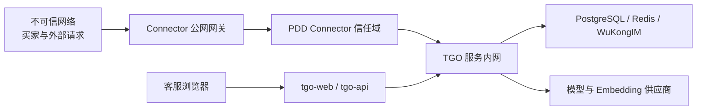
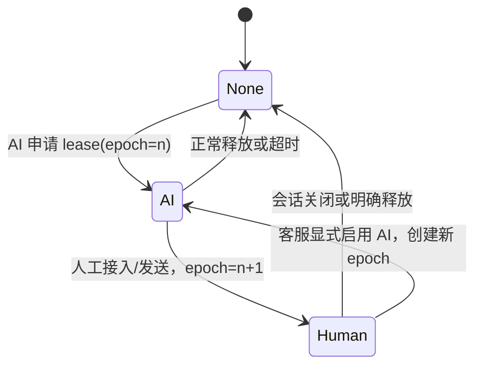

# 拼多多客服威胁模型

## 1. 范围、资产与信任边界

### 1.1 保护资产

- PDD 店铺凭据和回调验证材料。
- TGO Platform API Key、JWT、模型密钥和数据库凭据。
- 买家身份、消息、订单相关上下文和客服记录。
- Project、Platform、Visitor、Session 和知识库的租户隔离。
- AI/人工回复所有权。
- Inbox/Outbox 幂等状态和送达事实。
- RAG 文档、系统 Prompt、策略规则和审计日志。

### 1.2 信任边界

- 买家输入始终不可信。
- 外部回调在验证完成前不可信。
- 模型输出是候选，不是可信事实。
- RAG 文档也可能被污染，必须有来源和审批。
- 浏览器用户经过认证后仍只拥有 Project 和角色范围内权限。
- TGO internal API 只允许内网服务身份访问。

## 2. 安全目标

1. 未验证事件不能创建会话或触发 AI。
2. 同一事件和回复不能重复产生业务副作用。
3. 一个外部会话在任一时刻只有一个有效回复 owner。
4. 自动回答只能使用当前 Project 已批准知识。
5. 高风险或不确定请求不自动外发。
6. 密钥、完整个人数据和系统 Prompt 不进入普通日志或模型上下文。
7. 所有拒绝、转人工、AI 批准和外部发送均可审计。

## 3. 威胁与控制

| 编号 | 威胁 | 典型攻击或故障 | 预防控制 | 检测与响应 | 剩余风险 |
|---|---|---|---|---|---|
| TM-01 | 提示词注入 | 买家要求忽略系统规则、泄露 Prompt、调用工具或把检索文档中的指令当系统命令 | 买家文本和 RAG 文档都标记为不可信数据；Agent 工具最小授权；系统规则不可由用户覆盖；Guard 检查越权意图和敏感输出 | 记录注入原因码、Agent 工具调用和 Guard 拒绝；转人工 | 模型可能识别不完整，因此出站必须有确定性规则和默认拒绝 |
| TM-02 | 越权查询 | 买家诱导查询其他店铺、其他买家或其他 Project 的知识和会话 | Connector Binding 唯一映射；TGO 调用显式带 Project；Agent 只绑定当前 Project Collection；工具参数注入服务端租户条件 | 审计 project_id、collection_id、buyer_ref；发现跨租户参数立即中止并告警 | 第三方工具若忽略租户条件仍有风险，第一版不开放交易/订单工具 |
| TM-03 | 重复消息 | 渠道重试、网络超时或 Worker 重启导致同一消息多次触发 AI | Inbox 唯一 `(binding_id, dedupe_key)`；状态机重试；调用 TGO 前完成首次插入判定 | 重复计数、重复率监控、异常店铺限流 | 官方无稳定标识时摘要去重存在碰撞或漏判，需按官方能力评估 |
| TM-04 | AI 和人工同时回复 | AI 生成期间客服接入，双方都向买家发送 | Connector 原子 reply lease；人工增加 epoch 并撤销 AI；所有 PDD 出站经过 Connector；`ai_disabled` 作为 TGO 层第二道控制 | 记录 owner/epoch；发现旧 epoch Outbox 写入即安全告警 | 若存在绕过 Connector 的外部发送路径，互斥失效，因此网络和凭据必须阻断旁路 |
| TM-05 | 密钥泄漏 | 凭据写入 Git、日志、浏览器、Platform 普通 JSON 或错误堆栈 | Secret Store 引用；Connector 独占 PDD Secret；`.env`/密钥文件忽略；日志过滤；密钥最小权限和定期轮换 | Secret 扫描、异常调用监控、访问审计；泄漏后立即吊销和轮换 | 运行时内存仍可能暴露，需限制调试、Core dump 和容器访问 |
| TM-06 | 伪造 Webhook | 攻击者直接请求 Connector，伪造买家消息 | 只按官方资料验证来源、签名和必要解密；验证前不执行业务；入口限流；可用时结合 mTLS、IP 策略作为纵深防御 | 验证失败率、来源分布和突增告警；保留脱敏验证摘要 | IP allowlist 不能替代签名；官方协议能力不足时必须降低自动化范围 |
| TM-07 | 日志泄露 | 原始请求、买家 PII、Prompt、RAG 内容或密钥进入日志 | 结构化白名单日志；buyer_ref 和 event_ref 脱敏；原文加密独立保存；错误长度限制；禁止记录 Header/Secret | 日志 DLP 扫描、访问审计、保留期删除 | 开发调试打印可能绕过过滤，生产禁用 Debug 并审查日志调用 |
| TM-08 | 模型编造 | 模型虚构价格、库存、物流、退款承诺或政策 | RAG 证据必需；事实与证据一致性检查；实时或交易类问题一律转人工；禁止自动承诺 | 抽样质检、Guard 拒绝率、投诉与纠正记录；知识版本可追溯 | 语言生成仍可能产生细微偏差，自动范围限制为已审核静态 FAQ |
| TM-09 | 恶意买家输入 | 超长文本、控制字符、编码炸弹、辱骂、违法内容、数据外带指令 | 网关大小/速率限制；UTF-8 规范化；控制字符过滤；内容分类；模型和工具超时；非文本默认转人工 | 单 buyer_ref 速率告警、异常长度和分类统计；封禁或人工处理 | 语义攻击不断变化，需要持续更新规则但不得自动放宽 |
| TM-10 | 接口重放 | 攻击者重复发送曾经合法的请求 | 按官方协议验证时间/随机数/签名上下文；短期请求摘要缓存；Inbox 唯一状态；过期请求拒绝 | nonce/摘要重复告警、时间偏差监控 | 若官方不提供时间或随机数，无法完全区分合法重试与重放，只能降低风险并限制自动回复 |
| TM-11 | 出站重复 | 发送超时后误判失败，再次发送造成双回复 | Transactional Outbox；唯一 reply_id；优先使用官方幂等能力或发送结果查询；未知状态不换新 ID | `unknown` 状态队列和人工核对；重复确认告警 | 官方若没有幂等或查询能力，网络断点的送达不确定性无法完全消除 |
| TM-12 | SSRF | 恶意配置或消息诱导 Connector/Workflow 请求内网地址 | Connector 目的地址固定为官方允许端点和 TGO 内网；禁止从买家文本构造 URL；DNS/IP 出站策略 | 出站域名和目标 IP 监控 | TGO Workflow API 节点本身可访问 URL，第一版不向买家暴露工作流配置能力 |
| TM-13 | 知识库投毒 | 未审核文档包含错误政策或恶意指令 | 文档来源审批、版本和发布状态；生产 Agent 只绑定已发布 Collection；文档内容作为数据而非系统指令 | 新知识上线审计、检索命中抽样、回滚知识版本 | 可信人员误录仍可能发生，需要双人复核高风险政策 |
| TM-14 | 会话混淆 | 错误店铺/买家映射导致回复发给他人 | binding_id、buyer_ref、conversation_ref 三元检查；Outbox 再次解析映射；不接受客户端直接指定 Project | 映射冲突立即停用绑定并告警 | 外部平台标识复用规则必须由官方资料确认 |
| TM-15 | 拒绝服务 | 消息洪泛耗尽 Connector、模型、RAG 或客服队列 | 分层限流、每绑定配额、队列上限、熔断、超时、最大并发；高峰自动转人工但不无限排队模型任务 | 队列深度、延迟、错误率、模型 Token 和单买家频率告警 | 大规模攻击仍会影响人工容量，需运营应急预案 |
| TM-16 | 依赖或镜像供应链 | 被篡改依赖读取密钥或发送消息 | 锁定依赖和镜像摘要、最小容器权限、只读文件系统、SBOM 和漏洞扫描、签名制品 | 镜像变更审计和运行时异常出站告警 | 零日漏洞无法完全消除，需要快速回滚能力 |

## 4. 提示词注入专项

Prompt 安全采用分层控制：

1. **输入层**：删除不可见控制字符，限制长度，但保留原意供人工查看。
2. **上下文层**：系统指令、策略、RAG 证据和买家文本使用明确分隔；买家文本不得拼接为系统指令。
3. **工具层**：第一版不开放订单写工具；检索工具强制 Project/Collection，不接受买家提供租户参数。
4. **模型层**：指示模型拒绝泄露系统信息，但不把该指示当唯一防线。
5. **输出层**：Guard 检测 Prompt、Secret、跨租户数据、未授权链接和工具结果泄漏。
6. **决策层**：检测到注入或无法判断时转人工。

## 5. AI/人工竞态专项

不变量：

- Outbox 写入事务读取的 epoch 必须等于 AI run 开始时的 epoch。
- Human owner 可以抢占 AI，AI 不能抢占 Human。
- `visitor.ai_disabled=True` 时不能创建 AI lease。
- Session closed 时不能创建任何新回复。
- 旧 epoch 的 Worker 即使延迟恢复，也只能把任务标记为 revoked。

## 6. 密钥与日志策略

### 6.1 密钥

- PDD 凭据：仅 Connector Secret Store。
- TGO Platform API Key：Connector 通过引用读取。
- 模型和 Embedding Key：仅 `tgo-ai`/`tgo-rag` 所在服务。
- 浏览器：只获得短期用户会话，不获得平台或模型密钥。
- 开发和生产凭据完全分离。
- 轮换时支持新旧凭据短暂并行验证，但只有一个凭据可用于主动发送。

### 6.2 日志字段白名单

允许：

- `trace_id`
- `binding_id`
- 脱敏 `buyer_ref/conversation_ref/event_ref`
- 状态、原因码、延迟、重试次数
- Project、Agent、Collection 的内部 ID
- policy version、lease epoch、reply_id

禁止：

- Secret、Authorization、Cookie、完整签名材料
- 完整买家身份、地址、电话、支付信息
- 完整原始事件
- 完整系统 Prompt
- 未经脱敏的模型请求/响应

## 7. 安全测试

上线前必须通过：

- 伪造验证、篡改正文、过期请求和重复重放测试。
- 同一事件并发 100 次的 Inbox 唯一性测试。
- 人工在 AI 生成各阶段抢占的竞态测试。
- Outbox 超时、Worker 崩溃和重复恢复测试。
- 跨 Project、跨店铺、跨买家查询测试。
- Prompt 注入、RAG 文档注入和工具参数注入测试。
- Secret/PII 日志扫描。
- 无 RAG、冲突 RAG、过期 RAG 和模型幻觉测试。
- Connector 到非允许域名/IP 的出站阻断测试。

## 8. 事件响应

| 事件 | 立即动作 |
|---|---|
| PDD 凭据疑似泄漏 | 停用绑定、吊销凭据、停止自动回复、保全审计 |
| 跨租户数据暴露 | 停止 Connector 和相关 Project 自动化、隔离日志、启动安全调查 |
| 重复外部回复 | 暂停对应绑定 Outbox、核对 reply_id 与官方送达结果 |
| AI/人工双回复 | 全局关闭自动回复，检查旁路和 lease epoch |
| 大量伪造请求 | 限流/阻断来源，同时验证官方渠道可用性 |
| 知识库投毒 | 撤回知识版本、重新索引、定位受影响回答 |
| 日志含 Secret/PII | 限制日志访问、清理副本、轮换 Secret、修复过滤 |

自动回复恢复需要确认根因、完成回归测试并由授权人员按店铺重新启用。
