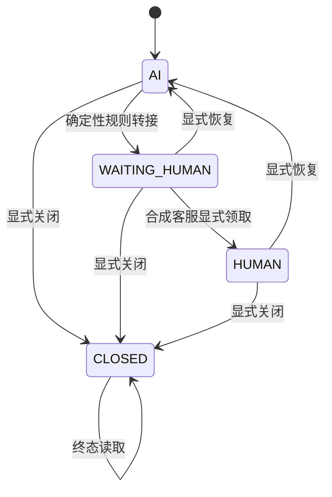

# 本地风险路由与人工转接运行手册

## 适用范围

本手册只适用于阶段8的本地、确定性、`FAKE/TEST`人工转接验证。系统不会调用
真实拼多多、真实模型、TGO业务API、真实客服账号、订单/退款/地址接口或生产
环境。`continue_ai`只允许继续阶段5的固定测试回复，不代表启用真实AI。

规则配置：

```text
config/pdd/transfer_rules.yml
config/pdd/forbidden_claims.yml
```

持久化默认位于：

```text
extensions/pdd-customer-service/.local/pdd-reliability.sqlite3
```

该文件被Git忽略，阶段6可靠性账本与阶段8转接状态共用schema v2，以便在一个
SQLite事务中同时改变会话模式、客服队列、审计和回复租约epoch。

## 规则顺序

路由按以下顺序返回第一项命中结果：

1. `CLOSED`终态：阻止处理；
2. `WAITING_HUMAN/HUMAN`：保持人工处理；
3. 买家明确要求人工；
4. 投诉、举报、法律或监管；
5. 退款、赔偿或改价；
6. 修改地址、取消订单或修改订单；
7. 产品安全或伤害；
8. 严重质量问题；
9. 没有有效知识；
10. 知识冲突；
11. 知识过期；
12. 服务故障；
13. 连续两次未解决；
14. 候选测试回复命中禁止承诺；
15. 其余且知识有效：继续固定测试流程。

文本只做Unicode NFKC、控制字符移除、空白压缩和大小写折叠，再执行审核配置的
关键词子串匹配。第一版不使用正则、分词、模糊匹配或模型分类。

固定转人工提示为：

```text
您的问题需要人工客服进一步处理，已为您转接，请稍候。
```

## 配置合同

两个`.yml`文件必须保持JSON兼容YAML 1.2，并由Python标准库`json`解析。配置
禁止包含密钥、真实买家文本、真实商品或公司政策。

`transfer_rules.yml`必须包含：

```text
schema_version = 1
handoff_message
text_rules[]
  priority（2到7，唯一且升序）
  reason_code（固定枚举且每类唯一）
  risk_level
  keywords（去重后非空）
```

`forbidden_claims.yml`必须包含：

```text
schema_version = 1
claims[]
  claim_id（唯一且明确FAKE/TEST）
  risk_level
  phrases（去重后非空）
```

缺文件、额外字段、空关键词、非法枚举、重复优先级、重复原因码或重复claim id
都会使启动失败。系统不会忽略错误后降级为空规则，错误响应也不会回显配置正文或
绝对路径。

修改配置时必须先增加或调整规则测试，再运行：

```bash
cd extensions/pdd-customer-service
poetry run python -m pytest tests/unit/test_risk_routing.py -q
make lint
make test
make security-check
```

## 会话模式与转换



禁止`AI → HUMAN`直接领取、无操作者恢复、未确认高风险恢复，以及从`CLOSED`
恢复或重新转接。`high/critical`恢复AI必须同时提交
`risk_acknowledged=true`。恢复操作只接受以`fake-`或`test-`开头的合成
操作者。

人工转接会原子地把reply lease所有者切到`human`并递增epoch。AI取得租约和
发送前都要求模式仍为`AI`且epoch未变化，因此WAITING、HUMAN和CLOSED模式中的
旧任务不能调用发送Adapter。

## 本地接口

先从扩展目录启动：

```bash
make run
```

所有会话标识和操作者必须以`fake-`或`test-`开头。以下请求只用于合成数据。

评估一条需要转人工的测试消息：

```bash
curl --fail-with-body -X POST http://127.0.0.1:8091/handoff/evaluate \
  -H 'content-type: application/json' \
  -d '{
    "conversation_key": {
      "shop_id": "fake-shop",
      "buyer_id": "fake-buyer",
      "conversation_id": "fake-conversation"
    },
    "message_text": "我要退款",
    "knowledge_status": "valid",
    "service_available": true,
    "unresolved_count": 0,
    "candidate_reply": null
  }'
```

读取不含消息正文的开放队列：

```bash
curl --fail http://127.0.0.1:8091/handoff/queue
```

领取、恢复和关闭：

```bash
BASE=http://127.0.0.1:8091/handoff/conversations/fake-shop/fake-buyer/fake-conversation

curl --fail-with-body -X POST "$BASE/claim" \
  -H 'content-type: application/json' \
  -d '{"operator":"fake-staff"}'

curl --fail-with-body -X POST "$BASE/resume" \
  -H 'content-type: application/json' \
  -d '{"operator":"fake-supervisor","risk_acknowledged":true}'

curl --fail-with-body -X POST "$BASE/close" \
  -H 'content-type: application/json' \
  -d '{"operator":"fake-staff"}'
```

正常响应只包含模式、原因码、风险、时间和合成会话键；队列与审计不保存消息
正文或候选回复。未知会话返回404，非法转换返回409，非FAKE/TEST输入返回422，
持久化不可用返回固定脱敏503。

## schema v2安全备份与恢复验证

禁止删除或重建SQLite来处理故障，也禁止删除`-wal`、`-shm`、Docker卷或失败
现场。先停止扩展的本地写入进程，不需要停止或删除TGO数据卷。

使用Python标准库SQLite在线备份API创建新副本：

```bash
cd extensions/pdd-customer-service
mkdir -p .local/backups
poetry run python -c "import sqlite3; s=sqlite3.connect('.local/pdd-reliability.sqlite3'); d=sqlite3.connect('.local/backups/pdd-reliability-backup.sqlite3'); s.backup(d); d.close(); s.close()"
```

备份目录同样被`.local/`规则忽略。不要在共享日志中输出表内容、消息正文或本地
绝对路径。

恢复时不覆盖、不移动、不删除原文件。先复制已审核的备份到新的Git忽略路径，
然后仅让验证进程指向副本：

```bash
mkdir -p .local/restore
cp .local/backups/pdd-reliability-backup.sqlite3 \
  .local/restore/pdd-reliability-restore-check.sqlite3
PDD_RELIABILITY_DB_PATH=.local/restore/pdd-reliability-restore-check.sqlite3 \
  poetry run uvicorn app.main:app --host 127.0.0.1 --port 8092
```

在新端口验证schema版本、会话模式、队列和审计数量后停止验证进程。只有人工确认
副本完整、来源正确且没有真实数据，才可以决定后续操作；本阶段不会自动替换原
数据库。

## 故障处理

- 配置合同错误：保留配置和日志，修复前不启动服务；
- SQLite忙、损坏或不可写：AI不发送，接口返回脱敏503；
- 非法转换：事务回滚，状态、lease、队列和审计保持不变；
- 重复转人工：保持单一开放队列项；
- 高风险未确认恢复：保持人工所有权；
- CLOSED会话：永久阻止新回复；
- 重启恢复旧Outbox时若模式不是AI：记录`ai_reply_blocked`且不发送。

每个错误最多两轮根因分析。两轮后仍失败就停止当前阶段，并在验证日志和阶段报告
中记录命令、错误、尝试与建议。不得删除测试、降低断言、关闭检查、自动修复
数据库或隐藏失败。

## 验收命令

```bash
cd extensions/pdd-customer-service
make format
make lint
make test-unit
make test-integration
make test
make security-check
git check-ignore -v .local/pdd-reliability.sqlite3
```

阶段8完成还要求：Gitleaks新增候选为0、`repos/*`变化为0、依赖/锁文件变化为
0，并确认15个TGO核心容器保持healthy。
