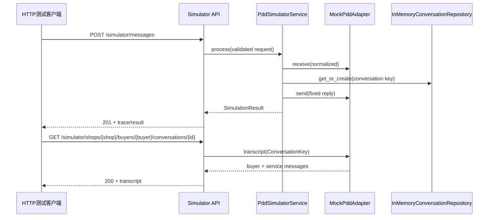

# 阶段5设计：本地PDD消息模拟器

## 批准依据

用户在本次无人值守执行附件中明确授权自动执行到阶段8，并为阶段5指定本地PDD
模拟服务、六个模拟字段、标准模型、Adapter边界、固定回复、日志和完整链路验收。
本设计只在这些已批准约束内选择最小实现方式，没有扩大到真实PDD或真实模型。

## 目标

在`extensions/pdd-customer-service/`内建立完全本地、无外部网络依赖的模拟消息
链路：

```text
明确的HTTP测试客户端
→ 模拟PDD入站
→ PDD Adapter接口
→ 标准化消息
→ 本地测试会话
→ 固定回复“已收到测试消息”
→ MockPddAdapter出站
→ 会话查询接口
```

该链路只使用合成数据，不访问真实拼多多、TGO业务API、模型、数据库或生产
服务。TGO阶段4基线继续运行，但阶段5模拟器不依赖用户尚未完成的浏览器初始化。

## 方案比较和选择

### 方案A：扩展内进程模拟器

在现有FastAPI应用中增加模拟HTTP路由，使用依赖注入的内存Adapter、会话仓库和
服务编排。优点是没有新依赖、可以严格隔离测试、完整覆盖HTTP收发链路，并与
未来真实Adapter保持同一接口。缺点是进程重启后状态不保留；持久恢复属于阶段6。

### 方案B：独立Docker模拟服务

把“模拟PDD”作为另一个容器，通过网络调用Connector。网络边界更接近未来真实
平台，但会过早增加Compose、端口、健康检查和部署维护，也会把阶段5扩展成两个
服务。

### 方案C：纯CLI或静态夹具

只用命令行把JSON交给服务函数。实现最小，但无法证明HTTP接入、买家查询回复和
FastAPI校验链路，不能满足完整收发验收。

选择方案A。它满足当前已批准范围，并把阶段6需要的持久化、去重、重试和并发
控制留在后续阶段。

## 组件边界

### 1. 传输与领域模型

`app/models/messages.py`定义：

- `PddTextMessageRequest`：本地模拟入站请求，字段固定为`message_id`、
  `shop_id`、`buyer_id`、`conversation_id`、`timestamp`和`content`。
- `NormalizedMessage`：经过本地模拟边界校验后的稳定内部文本消息，额外包含
  `received_at`、`trace_id`和固定来源`mock-pdd`。
- `OutboundMessage`：固定回复，包含`reply_id`、店铺/买家/会话引用、
  `in_reply_to_message_id`、`timestamp`和`content`。
- `ConversationKey`：由`shop_id`、`buyer_id`和`conversation_id`组成，禁止只用
  外部会话ID定位买家会话。
- `ConversationMessage`与`ConversationTranscript`：明确测试客户端读取的本地
  买家/客服对话视图。
- `SimulationResult`：POST结果，返回是否新建会话、标准化消息和出站消息。

所有标识去除首尾空白后必须非空；`timestamp`必须带时区；文本必须为1至4000
字符。超出范围或缺字段由FastAPI/Pydantic返回422，不进入Adapter。

### 2. PDD Adapter边界

`app/adapters/pdd/base.py`定义异步`PddAdapter` Protocol：

```python
async def receive(message: NormalizedMessage) -> None
async def send(message: OutboundMessage) -> None
async def transcript(key: ConversationKey) -> ConversationTranscript | None
```

`MockPddAdapter`只在内存记录消息：

- 每次`receive`调用追加一次买家消息；
- 每次`send`调用追加一次客服消息；
- `transcript`返回指定会话的不可变快照；
- 暴露只读计数供测试证明连接器只接收一次。

阶段5不对重复`message_id`去重。一次HTTP请求只调用一次`receive`；真正的唯一键、
幂等、并发和重放窗口必须在阶段6用明确状态机实现，不能在阶段5用临时集合冒充。

`RealPddAdapter`实现相同接口，但每个操作都抛出
`RealPddNotConfiguredError`。它不包含URL、字段、签名、请求代码或任何真实API
猜测，也不被默认应用装配。

### 3. 本地会话仓库

`app/repositories/conversations.py`定义内存会话仓库，以
`(shop_id, buyer_id, conversation_id)`作为本地测试会话键：

- 首条消息创建会话并返回`created=True`；
- 后续同键消息关联既有会话并返回`created=False`；
- 不同店铺或买家不能错误复用相同`conversation_id`。

该仓库不访问TGO数据库。阶段5验收采用附件允许的“本地测试会话”路径。

### 4. 模拟编排服务

`app/services/simulator.py`的`PddSimulatorService.process`按固定顺序执行：

1. 从请求创建`NormalizedMessage`和唯一`trace_id`；
2. 调用Adapter `receive`一次；
3. 创建或关联本地会话；
4. 创建内容严格为`已收到测试消息`的`OutboundMessage`；
5. 调用Adapter `send`一次；
6. 返回`SimulationResult`。

普通结构化日志只记录`trace_id`、`message_id`、`conversation_id`、事件名和方向；
不记录`content`。完整合成消息只存在于内存Adapter和HTTP测试结果，不进入普通
日志。

### 5. HTTP API

`app/api/simulator.py`提供：

```text
POST /simulator/messages
GET  /simulator/shops/{shop_id}/buyers/{buyer_id}/conversations/{conversation_id}
```

POST接收`PddTextMessageRequest`并返回`SimulationResult`。GET是明确的本地测试
客户端：买家使用完整`ConversationKey`读取收发记录。未知会话返回404。完整键
避免两个店铺或买家碰巧使用相同外部会话ID时发生串线。

应用工厂允许注入Adapter和会话仓库；默认只装配新的内存实例。每次测试创建全新
应用，测试之间不共享状态。服务继续只绑定`127.0.0.1:8091`。

## 数据流



## 错误处理

- 请求字段缺失、空标识、无时区时间或无效文本：422。
- 未知会话查询：404。
- `RealPddAdapter`被直接调用：显式未配置异常，不发网络请求。
- 默认Mock Adapter异常：返回500并保留异常证据；阶段5不添加静默重试。
- 任一失败不伪造成功回复，不吞掉异常。

阶段6再定义发送状态、重试、死信和数据库不可用行为。

## 测试设计

严格按RED、GREEN、REFACTOR执行：

1. 模型单元测试：字段、时区、文本限制和固定回复结构。
2. Adapter单元测试：单次收发、按会话读取、真实Adapter默认拒绝。
3. 会话仓库单元测试：创建、关联和跨店铺/买家隔离。
4. 服务单元测试：一次入站产生一次固定回复，日志可追踪但不含正文。
5. API集成测试：输入`你好`返回`已收到测试消息`。
6. 完整链路测试：POST后GET，买家视图按顺序看到`你好`和固定回复；Adapter
   入站与出站计数均为1。
7. 回归测试：原有`/health`仍返回200。

Mock只用于外部边界；服务、模型、仓库和FastAPI路由使用真实代码。

## 明确不做

- 不实现真实PDD URL、Webhook验证、签名、加密、应答或发送协议。
- 不连接真实PDD账号、商家后台或浏览器Cookie。
- 不调用真实TGO业务API、RAG、模型或数据库。
- 不增加依赖、Docker服务或TGO核心修改。
- 不实现去重、持久恢复、发送重试、死信、AI/人工互斥或风险规则。
- 不制作正式业务界面；HTTP接口和测试客户端即阶段5买家模拟入口。

## 验收

- 合成请求字段完整并通过类型校验；
- 输入`你好`时，Adapter入站计数为1；
- 创建或关联正确的本地测试会话；
- 出站内容严格等于`已收到测试消息`；
- POST后GET可看到顺序正确的买家消息和客服回复；
- 日志可通过`trace_id`、消息ID和会话ID追踪完整链路；
- 不需要真实凭据、外部网络或浏览器账号；
- 原健康检查、格式、类型、测试和安全命令全部通过；
- `repos/*`修改为0，Gitleaks受控源码候选不增加。
